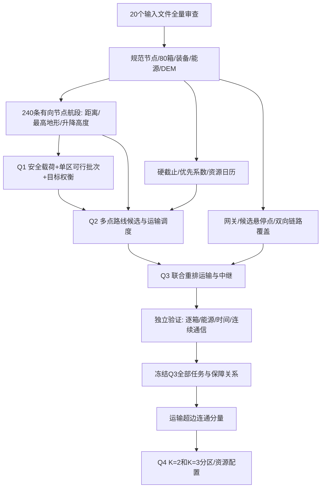

# 01 题目拆解：山区洪涝灾害下无人机运输与通信协同优化

本文件对应所给 PDF 的“2026 年中国研究生数学建模竞赛 D 题”。范围为赛题理解、附件审查、建模路线设计；没有运行调度优化，没有生成最终比赛答案或论文。所有数值审查均来自本地原始附件。背景报道不作为计算数据，比赛真实性及背景事件未另行核验。

## 1. 题目的核心结构

本题是“确定性地形与能耗计算 + 不可拆货箱组合优化 + 异构设备及独立能源资源调度 + 连续通信覆盖 + 冻结任务后的分区资源核算”。不需要训练预测模型，也不是道路最短路、洪水演进预测或一般聚类问题。

四问不是简单地把前一问解锁死后增加约束：Q1是基准能力与单点组批；Q2可重新跨区组批和访问排序；Q3可重新联合调整Q2运输任务；**只有Q4明确要求冻结Q3任务及通信保障关系**。

## 2. 实际文件与读取范围

实际输入为20个业务文件：根目录3个（赛题PDF、规范DOCX、结果模板XLSX），data内17个（5个基础XLSX、1个说明PDF、1个HTML、4组CSV/MAT、1组DEM TIF/MAT）。全部已实际读取。目录中已有的`.deps`是软件依赖，`.DS_Store`是系统元数据，均不作为赛题附件。data内没有额外TXT或Word文件；赛题提到的“地理空间数据说明.docx”，实际以同名PDF提供。

PDF全文已提取；第5页公式额外渲染核对，避免字体编码丢失造成指数误读。DOCX正文已从OOXML读取。全部Excel按真实分块表头读取，未把标题行当字段。四个MAT table按HDF5引用及打包UTF-16字符串解码，全字段与CSV逐列核对。DEM MAT为另一种MAT格式，单独读取。HTML完整读取并提取内嵌地理数据与展示栅格。

|附件|实际记录规模|服务于哪些问题|用途与边界|
|---|---|---|---|
|调度中心与服务区.xlsx|中心1×5，服务区15×6|Q1–Q4|节点坐标、规定地面海拔、服务区编号；人口用于说明/分区对照，不重新推算80箱需求|
|物资需求与配送时限.xlsx|需求汇总53×9，逐箱80×9|Q1–Q4|Q1箱重、体积及目的地；Q2/Q3增加逐箱时限、首批标签与优先系数；Q4继承交付任务|
|运输无人机数据.xlsx|机型3×18，实体8×3，电池库存3×3|Q1–Q4|Q1只用机型参数；Q2/Q3加入实体、独立电池及充电；Q4按型核算库存|
|中继无人机数据.xlsx|机型1×19，实体2×3，能源库存1×3|Q3/Q4|悬停、飞行、建链、周转、能源与高度上限|
|通信链路参数.xlsx|14条参数×4有效字段；原表C列为布局空列|Q3/Q4|按设备接口、传播与接收参数计算双向链路；Q4继承保障关系|
|DEM.tif、DEM.mat|各1309×1486高程矩阵|Q1–Q3直接使用，Q4继承|沿直线航段的最高地形和通信视线遮挡；不可用HTML简化栅格代替|
|道路.csv、道路.mat|各21015×7顶点，1829条要素|Q1–Q4背景图|不能把道路长度当飞行距离，未提供道路灾毁时间序列|
|村镇点位.csv、村镇点位.mat|各166×7|Q1–Q4背景核对|166个村镇点不是15个任务服务区；同名不等于同一任务节点|
|水体.csv、水体.mat|各4229×9顶点，95个要素|Q1–Q4背景图|多边形编号、环编号、点序不可丢；未给水深、洪水边界或禁飞约束|
|水系.csv、水系.mat|各4570×8顶点，101条要素|Q1–Q4背景图|长度_km为要素级属性，在顶点重复，不能逐行累加|
|地理空间数据说明.pdf|1页说明|全部|WGS84、DSM、像元中心、NoData定义|
|地理空间详情地图.html|496文本行，7个已解析FeatureCollection及159×180展示高程|全部辅助|含边界、任务点、道路水系等；仅用于空间理解，不增加题目约束|
|结果提交模板.xlsx|6张空结果表|全部|列契约见附录；样式占用行不等于结果条数|
|论文格式规范.docx|格式说明正文|后续写作阶段|本轮只读取：匿名、无页眉、摘要起页码、引用及源程序要求；未写论文|

所有字段、类型、缺失、异常筛查、首末记录、哈希和空间范围详见本文件末尾的**全量审查附录**。配套审查脚本与提取记录位于`审查记录/`，仅用于数据审查。

## 3. 数据审查结论及建模影响

### 3.1 规模、需求与时间

- 15个服务区本次保障人口合计3422，不是背景提到的“全乡约8000”。按给定80箱执行，不用人口比例重配需求。
- 80个箱号唯一，总质量758 kg，总体积2.011 m³；医疗16箱、首批30箱，二者重叠15箱。因此有31箱具有至少一项硬截止约束。
- 汇总53行与逐箱清单的需求数、首批数、箱重、箱体积、期望时间、优先系数一致。
- 期望时刻3600–18000 s，首批截止3600–10800 s；这是从统一任务起点计时的相对秒数，不是实测历史时间序列。没有可用于预测灾情或拟合飞行模型的标注样本。
- 首批期限空值：汇总23个、逐箱50个，均表示对应非首批无此要求；保留“不适用”，不可补0或补均值。
- S012、S014医疗箱虽期望7200 s，首批截止3600 s，所以硬截止取二者较小值；S001-MED-02虽非首批，医疗期望3600 s仍是硬截止。

|服务区|箱数|质量kg|体积m³|
|---|---:|---:|---:|
|S001|15|154|0.394|
|S002、S003（各）|8|81|0.211|
|S004、S005、S006（各）|6|59|0.156|
|S007、S008（各）|5|45|0.129|
|S009–S015（各）|3|25|0.067|

S009–S015的“医疗+饮水+食品”各25 kg、0.067 m³：即使重量恰好满足A型25 kg，也超过其0.060 m³体积上限；B型0.073 m³可容纳但仍须检查地形能耗。该差异直接支持二维容量组批，不能只按重量装箱。

### 3.2 装备与能源

|类型|实体数|共享能源总数|最大载重kg|体积m³|可用能量kWh|完全充电s|
|---|---:|---:|---:|---:|---:|---:|
|A|4|6|25|0.060|4.5|1800|
|B|2|4|30|0.073|4.0|2400|
|C|2|4|80|0.250|8.0|3000|
|R中继|2|6|不承担物资运输|不适用|3.2|1800|

全部初始SOC100%，返航下限20%。共享电池总数已含初装电池，不得额外加实体数。不同机型电池不混用；中继能源不能当运输电池使用。题目明确不同能源资源可并行充电，未给有限充电桩数量，不额外制造单充电桩瓶颈。中继起飞总质量23.5 kg已含21 kg本体与能源和2.5 kg通信模块，不得重复加模块质量。

### 3.3 空间与异常

DEM共1,945,174个float32像元，数值范围41.689079–1132.856079 m，无NaN、无-32767；TIF/MAT逐元素完全相同。中心经度109.032777778–109.445277778°，纬度22.861388889–23.224722222°，分辨率1/3600°，非严格的两个方向均30 m。16个任务节点均在覆盖范围内。服务区坐标范围109.1688578–109.2835966°E、23.0052097–23.0795113°N，给定海拔154–444.5 m。

CSV和配套MAT均无形式空值、无整行重复，所有顶点序号连续，水体环全部闭合。道路18518行、水系3618行、水体3173行名称为“未记录”，属于语义缺失，保留要素编号即可；不能以名称联表。IQR筛出的高人口、较多箱数、长线要素等是待解释分布特征，无证据表明应删除。DEM没有实测真值或质量旗标，不能声称已排除所有高程误差。

坐标精确范围：道路/水系为[109.0328115,109.4450943]×[22.8615453,23.2247021]°；水体为[109.0328115,109.4415618]×[22.8615453,23.2231813]°；村镇为[109.036,109.445]×[22.8624,23.2242]°。全部无观测日期字段；时间范围不适用。

必须处理的高程口径：节点给定海拔与最近DEM像元存在差异，DEM减表值范围为−10.563 m（S009）至+7.389 m（S008），O01为+1.026 m。默认节点作业高度使用Excel规定值，沿线遮挡及净空使用DEM；端点插值和近地视线判定须显式记录，不能静默覆盖节点海拔。

## 4. 四问逐项拆解

### 问题一：单点往返能力与货箱组批

|要素|本题要求|
|---|---|
|真正回答什么|3机型×15区的安全载荷边界；80箱如何分成单区往返架次；架次、能耗、累计作业时间怎样权衡；安全余量变化如何改变上述结论|
|数学本质|给定机理的单调能力边界计算 + 双容量、能源约束的异构装箱/集合划分|
|输入|16节点、原始DEM、3机型参数、80箱目的地/质量/体积，基准余量20%|
|输出|45项最大安全载荷；逐架次机型与货箱集合；每架次能耗/SOC/作业时间；目标对照与余量敏感性|
|变量/待估参数|批次是否选择、机型选择；连续能力变量q。无统计待估参数|
|已知条件|每架次严格O01→Si→O01；去程携带本批全部货物，回程空载；不考虑实体和电池调度|
|约束|同批同区、每箱恰一次、不可拆分、载重、体积、全往返能耗≤可用能量×(1−余量)|
|评价指标|N架次、E总kWh、A累计作业秒数；安全余量下的可达性和装载余量|
|依赖关系|可独立求解；提供公共物理计算和Q2初始候选，Q2不被本问组批锁死|
|论文必须给出|能力矩阵与不可行标记、具体组批、目标优先次序、基准比较、安全余量引起的分批跳变与瓶颈解释|

能力连续上限与实际离散装箱质量分开报告；不存在可行空载往返时应标记不可行，不能把“0 kg安全载荷”误写成能执行空载任务。第一问不强加第二问物资截止或8架库存，不把累计作业时间当并行完工时间。

### 问题二：异构多点多架次运输调度

|要素|本题要求|
|---|---|
|真正回答什么|在8架实体机、14组分型电池条件下联合决定组批、访问顺序、机型、实体、电池、开始时刻，全部交付且满足硬时限|
|数学本质|异构多趟车辆路径 + 不可拆逐箱配送 + 双资源区间调度，航段载荷递减导致非线性能耗|
|输入|Q1公共几何与能耗函数、80箱完整属性、实体库存和充电参数|
|输出|运输路线与架次表、逐箱交付完成时刻、飞机占用与电池任务/充电/SOC台账、指标与可行性证据|
|变量/参数|箱到架次指派、每架次节点序列、机型/实体/电池选择、连续开始时刻；参数由附件直接给定|
|已知条件|可多区访问；最后返O01；机型内共享电池可跨实体；再用前充满|
|约束|覆盖唯一性、逐段载重/体积、全架次能源、实体不重叠、电池任务充电不重叠、同型匹配、医疗与首批硬截止|
|评价指标|附件优先系数加权的非医疗迟到、全部运输机最后返航的最晚时刻、总运输能耗、运输架次数；另报准时率与硬约束违反数|
|依赖关系|可以直接基于原始数据求解；复用Q1验证过的物理层、候选批次和基准，但允许重组|
|论文必须给出|可执行路线与时间表、80箱结果、硬截止零违反、资源SOC证据；单点与多点收益及软目标权衡|

交付时间应为交接完成而非抵达；同站交付默认以该次完整交接结束统一计时，若改为逐箱交接顺序须新增并明确该决策。准备时间计入实体占用及首次出发时刻。

### 问题三：运输与中继联合调度

|要素|本题要求|
|---|---|
|真正回答什么|在所有运输飞行和投送时段持续通信的前提下，重排运输与2架中继机、6组能源组件；决定中继位置/海拔/服务时段|
|数学本质|确定性三维链路预算 + 时空覆盖与设备/能源同步调度 + 离散连续联合优化|
|输入|Q2全部输入与候选解、原始DEM、网关20m天线高度、14通信参数、中继参数及库存|
|输出|修订后的运输表与80箱交付表、中继架次与能源台账、完整通信保障区间、链路裕量及联合指标|
|变量/参数|Q2全部变量；中继悬停经纬度/海拔、开始/建链完成/服务结束时刻、实体和能源组件指派、运输通信保障分配|
|已知条件|仅直连或单中继两段链路；无中继间多跳；须同刻接入/回传双向可用；建链完成后才服务|
|约束|Q2约束、DEM域内悬停、离地≤300m、中继飞行净空/返航能源/周转、运输全过程通信、不允许一机同时占不同悬停点|
|评价指标|及时性、两类最后返航的联合完工时间、运输+中继总能耗、两类架次数；最差链路裕量、未覆盖总时长|
|依赖关系|继承公共规则；Q2是初始解和对照而非固定输入路线；Q4必须冻结本问最终可行解|
|论文必须给出|哪里/何时必须用中继，具体联合调度、全部阶段连续覆盖证据、资源与时限核验、通信保障造成的代价|

附件未给单中继最大并发接入数、带宽或网关容量，因此基准只按题给链路可用性，不自行添加“一中继只服务一架运输机”。也不能由此声称真实通信系统有无限容量；结论限定在题给模型内。

### 问题四：冻结联合任务下的分区与配置

|要素|本题要求|
|---|---|
|真正回答什么|把15区分成2组/3组，每组独立执行冻结的运输和通信任务，计算各类型最少配置、冗余、均衡与库存缺口|
|数学本质|带不可拆超边的集合分区 + 固定时间区间着色/资源峰值核算|
|输入|Q3冻结的箱批、访问序列、各阶段时刻、机型、能耗、通信服务关系、资源周转口径；原库存|
|输出|K=2、3分别的区划及逐组8维资源向量、全局资源缺口、冗余、工作量均衡；若不能分组给出结构性不可行证据|
|变量/参数|服务区/运输连通分量所属组；每组按类别需要的数量及组内资源重新编号。Q3的任务时间、位置和能耗成为常数|
|已知条件|每区恰归一组、每组非空、多点同架次所涉区域同组；资源在执行期不得跨组借用|
|约束|冻结运输与中继时空安排及保障关系；保持组内资源不重叠；不可用重排时间消除缺口|
|评价指标|8维配置规模、相对未分区的额外需求、逐型库存缺口、最大/平均组工作量或变异系数；不伪造采购价格|
|依赖关系|严格依赖Q3，Q3未求解前只能确定算法，不能输出真实区划或配置数量|
|论文必须给出|两种分区及资源向量、峰值证据、跨组共享被切断的代价、短缺的具体类型与时间冲突原因|

跨组共享同一中继架次的处理见03：基准采用按涉组复制冻结中继任务的独立资源核算，不移动位置、不缩短服务、不共享实体；同时检查“禁止复制则必须同组”的严格解释，不能默认一个原中继实体仍被多个独立组共用。

## 5. 需要明确说明的模型口径

|事项|事实与拟采用口径|验证/风险|
|---|---|---|
|水平/爬升能耗|PDF给了等效航程及总能耗分解，未展开两分量公式；拟由电量/等效航程与重力势能/效率补齐，公式见03，明确为建模闭合假设|不得伪称PDF逐字给出；需量纲、空载/满载极限验证|
|运输交接能耗|附件没有运输悬停功率；基准能耗仅按附录航段水平+爬升，交接计时间不擅加能耗|真实悬停耗能属于模型局限，不用中继功率代替|
|中继建链能耗|30s建链在悬停点，拟保守按悬停+通信功率计算；服务时间从建链后开始|同时给“不计通信附加功率的建链”敏感性对照|
|中继巡航海拔|悬停点可高于沿线DEM+50m；拟取max(沿线DEM+50m，两端作业海拔)，保证先爬升后下降且无负高度|这是适应悬停高度的必要解释；应在正文列出|
|准备与能源占用|基准从架次准备开始占用所选满电能源及实体；运输无另给周转，中继返航后300s不可再准备|可与“起飞才装电池”口径比较，不能静默混用|
|节点海拔差|以Excel规定作业海拔，DEM用于沿线地形；端点高程差记录并核验|端点近地可能发生栅格遮挡，不能人为裁掉整段山体|
|第四问资源身份|冻结任务日程，允许组内对同型资源重新编号以核算最少数量；不改任务时空安排|另列原实体/原电池ID保持时的配置上界；二者不能混称|

## 6. 总体数据流与中间产物

后续应保存而本轮尚不生成的计算产物：

|产物|必须保存的字段|被谁使用|
|---|---|---|
|规范数据与口径版本|原文件哈希、单位、Excel原行号、NoData与坐标变换|全部可复现性|
|航段表|起终点ID、d、H、爬升/下降、DEM穿越像元、各型飞行时间|Q1–Q3与独立校验|
|可行批次表|箱ID集合、型、质量、体积、E、各阶段时间、SOC|Q1结果与Q2候选|
|运输任务事件表|准备、起飞、逐段阶段、交接开始/完成、返航、实体和电池ID|Q2/Q3验证、Q4冻结|
|能源台账|资源ID/类型、SOC前后、任务区间、充电区间、再可用时刻|Q2–Q4|
|中继任务表|位置与海拔、准备、飞行、建链、服务、返航、周转、能源ID|Q3/Q4|
|通信证据|运输架次、阶段、闭合覆盖区间、直连/中继ID、两段双向最差裕量、验证精度|Q3连续性证据、Q4共享关系|
|分区资源表|区域集合、原任务ID、复制中继映射、各型峰值及发生时刻|Q4规模/冗余/缺口|

可并行独立开展的是数据规范、地形几何、时限审查、机型参数核算和通信公式核对；Q1各区也可独立优化。Q2/Q3不能把15区完全独立调度后直接拼接，因为共享实体、电池和中继会冲突。Q4必须等待Q3最终日程。

## 7. 本轮停止点

本轮完成实际读取和路线设计，不计算45项最终载荷、不执行完整组批/调度搜索、不声称有最优目标或可行比赛方案。02比较模型，03给出可实施数学方案，待确认后再进入完整编程阶段。

---

# 附录：全量数据审查
# 全量读取与字段审查记录

所有输入只读。行数均不含表头；Excel布局尺寸另记。无采集时间字段，不推断历史时间范围。
## 输入清单
|文件|字节|SHA256|
|---|---:|---|
|data/无人机应急物资运输基础数据/中继无人机数据.xlsx|11082|be52643ff29419233e6a141dca03a04160a8af551cab36d8c49b51bb836bea04|
|data/无人机应急物资运输基础数据/物资需求与配送时限.xlsx|17474|5a3346159ceddcf585859d270b8f62114b388a1f737fbe64ffde0ee1fdc8170a|
|data/无人机应急物资运输基础数据/调度中心与服务区.xlsx|11017|541a7af1ded08c9a3ff448480332cb5f6a54902f0afa6e9bcd50c1d2b2b34e38|
|data/无人机应急物资运输基础数据/运输无人机数据.xlsx|11746|9296a657c07e042afba6aeea7999665d9cd24e00b592fd6c269de6e338480dcb|
|data/无人机应急物资运输基础数据/通信链路参数.xlsx|10485|1860d153199e7ae460ba36e83b673374e640e19de91ea167f2877271001f5f81|
|data/镇龙乡地理空间数据/镇龙乡及周边地理数据/数字高程模型数据（DEM）/镇龙乡及周边30米DEM.mat|6746494|c68703e0cc8f94f4bd52ff6e9974b66a2dae33865f0723ad71c04b6694bf4fbf|
|data/镇龙乡地理空间数据/镇龙乡及周边地理数据/数字高程模型数据（DEM）/镇龙乡及周边30米DEM.tif|7867096|741fe6de0b2bcaffd0f4007f574ee698d46197094f52cc954b532c4f90fc7c03|
|data/镇龙乡地理空间数据/镇龙乡及周边地理数据/村镇点位/镇龙乡及周边村镇点位.csv|9569|b6e2ffc0b728fb33c532e471b6f27dcb54ff70a9a2025546539eea97e5232d6f|
|data/镇龙乡地理空间数据/镇龙乡及周边地理数据/村镇点位/镇龙乡及周边村镇点位.mat|119280|61419e92447ada38c56b7f64f04e4aada2eb1ed076ae33e95f1cbc69f3514beb|
|data/镇龙乡地理空间数据/镇龙乡及周边地理数据/水体（面）/镇龙乡及周边水体.csv|279146|4d72a2b46d893701da635ac1b083539568ad3a8b9ffb1b28b09c06bf8af74324|
|data/镇龙乡地理空间数据/镇龙乡及周边地理数据/水体（面）/镇龙乡及周边水体.mat|179705|b79df14bdc0b22811f5c219897a66775d8879a93c4a865e455d8c43ab099b50a|
|data/镇龙乡地理空间数据/镇龙乡及周边地理数据/水系（线）/镇龙乡及周边水系.csv|297223|3502b997e000e8043e36b7159202bafb12a0c21d23a8b5ad4ec6877bad580a65|
|data/镇龙乡地理空间数据/镇龙乡及周边地理数据/水系（线）/镇龙乡及周边水系.mat|179598|b89f4f294bf771962676009fa9044f46ef26a06613fb6f91e2c6f9ccd430f8e8|
|data/镇龙乡地理空间数据/镇龙乡及周边地理数据/道路/镇龙乡及周边道路.csv|1423481|adcd23b4ae2c28475412fc2c8a3c0504b2a293ac2ec25faa1da2fe3c3d063ebe|
|data/镇龙乡地理空间数据/镇龙乡及周边地理数据/道路/镇龙乡及周边道路.mat|399882|c868717284d8aee60157e3bc9b20e18a81b26fde3d75fc7d80317ef877af9849|
|data/镇龙乡地理空间数据/镇龙乡地理空间数据说明.pdf|85812|6d1522c6832a5d91a108dae0d07954845025c0dabd44af8ee78c7860d7c405e4|
|data/镇龙乡地理空间数据/镇龙乡地理空间详情地图.html|4701273|5bb8082f4f5913e6787f86fa9dd3b6f8cbcfa309359f222f57355d1ae991b452|
|山区洪涝灾害下无人机运输与通信协同优化.pdf|3101182|54e5552969db0d7afc92fd13ed1525cef49539e4f4710d40d19ed179dbd1792c|
|结果提交模板.xlsx|20893|16f521f29a7103c4ff7c3709ce1696bb9fffa18ce741895e45b7bc7afaf3320a|
|附件2：“华为杯”第二十三届中国研究生数学建模竞赛论文格式规范.docx|82588|544687268d2a49e47c56f8f0aee9dd885dcd4a77528adfa0bc11c27d701d2c23|

## 镇龙乡及周边村镇点位.csv
记录数×字段数：166×7；整行重复：0。
|字段|类型|空值|范围/不同值数|单位|IQR疑似极端值数|
|---|---|---:|---|---|---:|
|点位编号|str|0|166种；ST001,ST002,ST003,ST004,ST005,ST006|未标注/标识或无量纲|—|
|名称|str|0|161种；黎塘镇,三里镇,云表镇,五里镇,黄练镇,定布|未标注/标识或无量纲|—|
|类别|str|0|2种；乡镇,村庄|未标注/标识或无量纲|—|
|OSM编号|int64|0|6.21893e+08～1.16372e+10|未标注/标识或无量纲|0|
|位置|str|0|2种；乡外,乡内|未标注/标识或无量纲|—|
|经度|float64|0|109.036～109.445|°|0|
|纬度|float64|0|22.8624～23.2242|°|0|
IQR仅作分布审查，不代表数据错误；编号、箱数和设计参数的极端值不自动剔除。
首记录：{'点位编号': 'ST001', '名称': '黎塘镇', '类别': '乡镇', 'OSM编号': 621892885, '位置': '乡外', '经度': 109.129485, '纬度': 23.20284}
末记录：{'点位编号': 'ST166', '名称': '黄兴', '类别': '村庄', 'OSM编号': 11637200697, '位置': '乡外', '经度': 109.0865984, '纬度': 23.1169218}
名称为“未记录”的语义缺失：0
独立要素数：166
配套 MAT：MATLAB v7.3 table，已读取全部 HDF 数据集并解码打包 UTF-16 字符串。
- 点位编号：全列一致（#refs#/c）
- 名称：全列一致（#refs#/d）
- 类别：全列一致（#refs#/e）
- OSM编号：全列一致（#refs#/f）
- 位置：全列一致（#refs#/g）
- 经度：全列一致（#refs#/n）
- 纬度：全列一致（#refs#/o）

## 镇龙乡及周边水体.csv
记录数×字段数：4229×9；整行重复：0。
|字段|类型|空值|范围/不同值数|单位|IQR疑似极端值数|
|---|---|---:|---|---|---:|
|水体要素编号|str|0|95种；WS001,WS002,WS003,WS004,WS005,WS006|未标注/标识或无量纲|—|
|多边形编号|int64|0|1～6|未标注/标识或无量纲|50|
|环编号|int64|0|1～1|未标注/标识或无量纲|0|
|点序号|int64|0|1～509|未标注/标识或无量纲|432|
|名称|str|0|6种；未记录,青年水库,大陆水库,酒饼塘,六旺水库,六蓝水库|未标注/标识或无量纲|—|
|水体类型|str|0|4种；一般水体,水库,池塘,蓄水池|未标注/标识或无量纲|—|
|OSM编号|int64|0|7.1695e+06～1.53611e+09|未标注/标识或无量纲|0|
|经度|float64|0|109.033～109.442|°|0|
|纬度|float64|0|22.8615～23.2232|°|0|
IQR仅作分布审查，不代表数据错误；编号、箱数和设计参数的极端值不自动剔除。
首记录：{'水体要素编号': 'WS001', '多边形编号': 1, '环编号': 1, '点序号': 1, '名称': '未记录', '水体类型': '一般水体', 'OSM编号': 387829312, '经度': 109.0568256, '纬度': 22.8872183}
末记录：{'水体要素编号': 'WS095', '多边形编号': 6, '环编号': 1, '点序号': 7, '名称': '六蓝水库', '水体类型': '水库', 'OSM编号': 7169504, '经度': 109.2655832, '纬度': 22.9493686}
名称为“未记录”的语义缺失：3173
独立要素数：95
配套 MAT：MATLAB v7.3 table，已读取全部 HDF 数据集并解码打包 UTF-16 字符串。
- 水体要素编号：全列一致（#refs#/c）
- 多边形编号：全列一致（#refs#/i）
- 环编号：全列一致（#refs#/j）
- 点序号：全列一致（#refs#/k）
- 名称：全列一致（#refs#/d）
- 水体类型：全列一致（#refs#/e）
- OSM编号：全列一致（#refs#/f）
- 经度：全列一致（#refs#/o）
- 纬度：全列一致（#refs#/p）
点序列非连续组数：0。
多边形未闭合环数：0。

## 镇龙乡及周边水系.csv
记录数×字段数：4570×8；整行重复：0。
|字段|类型|空值|范围/不同值数|单位|IQR疑似极端值数|
|---|---|---:|---|---|---:|
|水系要素编号|str|0|101种；WY001,WY002,WY003,WY004,WY005,WY006|未标注/标识或无量纲|—|
|点序号|int64|0|1～282|未标注/标识或无量纲|158|
|名称|str|0|4种；镇龙江,未记录,蒙公河,南河|未标注/标识或无量纲|—|
|水系类型|str|0|4种；河流,溪流,排水沟,渠道|未标注/标识或无量纲|—|
|OSM编号|int64|0|4.23676e+07～1.53611e+09|未标注/标识或无量纲|0|
|长度_km|float64|0|0.011～23.364|km|466|
|经度|float64|0|109.033～109.445|°|0|
|纬度|float64|0|22.8615～23.2247|°|0|
IQR仅作分布审查，不代表数据错误；编号、箱数和设计参数的极端值不自动剔除。
首记录：{'水系要素编号': 'WY001', '点序号': 1, '名称': '镇龙江', '水系类型': '河流', 'OSM编号': 42367634, '长度_km': 3.713, '经度': 109.4093216, '纬度': 22.8741428}
末记录：{'水系要素编号': 'WY101', '点序号': 41, '名称': '未记录', '水系类型': '溪流', 'OSM编号': 1536112038, '长度_km': 4.126, '经度': 109.1515642, '纬度': 22.954778}
名称为“未记录”的语义缺失：3618
独立要素数：101
配套 MAT：MATLAB v7.3 table，已读取全部 HDF 数据集并解码打包 UTF-16 字符串。
- 水系要素编号：全列一致（#refs#/c）
- 点序号：全列一致（#refs#/i）
- 名称：全列一致（#refs#/d）
- 水系类型：全列一致（#refs#/e）
- OSM编号：全列一致（#refs#/f）
- 长度_km：全列一致（#refs#/m）
- 经度：全列一致（#refs#/n）
- 纬度：全列一致（#refs#/o）
点序列非连续组数：0。

## 镇龙乡及周边道路.csv
记录数×字段数：21015×7；整行重复：0。
|字段|类型|空值|范围/不同值数|单位|IQR疑似极端值数|
|---|---|---:|---|---|---:|
|道路要素编号|str|0|1829种；RD0001,RD0002,RD0003,RD0004,RD0005,RD0006|未标注/标识或无量纲|—|
|点序号|int64|0|1～387|未标注/标识或无量纲|2450|
|名称|str|0|36种；柳南高速,未记录,南宁—宾阳—黎塘一级公路,横州大道,兴六高速,运河路|未标注/标识或无量纲|—|
|道路类型|str|0|19种；高速公路,高速公路匝道,干线公路,次要道路,一般道路,居住区道路|未标注/标识或无量纲|—|
|OSM编号|int64|0|4.91779e+07～1.53894e+09|未标注/标识或无量纲|0|
|经度|float64|0|109.033～109.445|°|0|
|纬度|float64|0|22.8615～23.2247|°|0|
IQR仅作分布审查，不代表数据错误；编号、箱数和设计参数的极端值不自动剔除。
首记录：{'道路要素编号': 'RD0001', '点序号': 1, '名称': '柳南高速', '道路类型': '高速公路', 'OSM编号': 49177928, '经度': 109.0378916, '纬度': 23.1863366}
末记录：{'道路要素编号': 'RD1829', '点序号': 17, '名称': '未记录', '道路类型': '人行步道', 'OSM编号': 1538936238, '经度': 109.3872968, '纬度': 23.1736541}
名称为“未记录”的语义缺失：18518
独立要素数：1829
配套 MAT：MATLAB v7.3 table，已读取全部 HDF 数据集并解码打包 UTF-16 字符串。
- 道路要素编号：全列一致（#refs#/c）
- 点序号：全列一致（#refs#/i）
- 名称：全列一致（#refs#/d）
- 道路类型：全列一致（#refs#/e）
- OSM编号：全列一致（#refs#/f）
- 经度：全列一致（#refs#/m）
- 纬度：全列一致（#refs#/n）
点序列非连续组数：0。

## 中继无人机数据.xlsx
工作表 `数据` 布局 12×19。
### 表头第2行，数据第3～3行
记录数×字段数：1×19；整行重复：0。
|字段|类型|空值|范围/不同值数|单位|IQR疑似极端值数|
|---|---|---:|---|---|---:|
|机型编号|str|0|1种；R|未标注/标识或无量纲|—|
|机型名称|str|0|1种；中继标准测试多旋翼|未标注/标识或无量纲|—|
|含能源组件空载总质量（kg）|int64|0|21～21|kg|0|
|中继通信模块质量（kg）|float64|0|2.5～2.5|kg|0|
|计划起飞总质量（kg）|float64|0|23.5～23.5|kg|0|
|计划巡航速度（m/s）|int64|0|15～15|m/s|0|
|巡航功率（kW）|float64|0|1.15～1.15|kW|0|
|能源组件可用能量（kWh）|float64|0|3.2～3.2|kWh|0|
|返航电量下限（%）|int64|0|20～20|%|0|
|工位固定准备时间（s）|int64|0|180～180|s|0|
|建链时间（s）|int64|0|30～30|s|0|
|架次周转时间（s）|int64|0|300～300|s|0|
|最大爬升速度（m/s）|int64|0|4～4|m/s|0|
|最大下降速度（m/s）|int64|0|3～3|m/s|0|
|爬升能耗效率|float64|0|0.72～0.72|未标注/标识或无量纲|0|
|下降能耗效率|int64|0|0～0|未标注/标识或无量纲|0|
|悬停功率（kW）|float64|0|1.05～1.05|kW|0|
|通信附加功率（kW）|float64|0|0.05～0.05|kW|0|
|最大悬停离地高度（m）|int64|0|300～300|m|0|
IQR仅作分布审查，不代表数据错误；编号、箱数和设计参数的极端值不自动剔除。
首记录：{'机型编号': 'R', '机型名称': '中继标准测试多旋翼', '含能源组件空载总质量（kg）': 21, '中继通信模块质量（kg）': 2.5, '计划起飞总质量（kg）': 23.5, '计划巡航速度（m/s）': 15, '巡航功率（kW）': 1.15, '能源组件可用能量（kWh）': 3.2, '返航电量下限（%）': 20, '工位固定准备时间（s）': 180, '建链时间（s）': 30, '架次周转时间（s）': 300, '最大爬升速度（m/s）': 4, '最大下降速度（m/s）': 3, '爬升能耗效率': 0.72, '下降能耗效率': 0, '悬停功率（kW）': 1.05, '通信附加功率（kW）': 0.05, '最大悬停离地高度（m）': 300}
末记录：{'机型编号': 'R', '机型名称': '中继标准测试多旋翼', '含能源组件空载总质量（kg）': 21, '中继通信模块质量（kg）': 2.5, '计划起飞总质量（kg）': 23.5, '计划巡航速度（m/s）': 15, '巡航功率（kW）': 1.15, '能源组件可用能量（kWh）': 3.2, '返航电量下限（%）': 20, '工位固定准备时间（s）': 180, '建链时间（s）': 30, '架次周转时间（s）': 300, '最大爬升速度（m/s）': 4, '最大下降速度（m/s）': 3, '爬升能耗效率': 0.72, '下降能耗效率': 0, '悬停功率（kW）': 1.05, '通信附加功率（kW）': 0.05, '最大悬停离地高度（m）': 300}
### 表头第6行，数据第7～8行
记录数×字段数：2×3；整行重复：0。
|字段|类型|空值|范围/不同值数|单位|IQR疑似极端值数|
|---|---|---:|---|---|---:|
|中继无人机编号|str|0|2种；R01,R02|未标注/标识或无量纲|—|
|机型编号|str|0|1种；R|未标注/标识或无量纲|—|
|初始位置|str|0|1种；O01|未标注/标识或无量纲|—|
IQR仅作分布审查，不代表数据错误；编号、箱数和设计参数的极端值不自动剔除。
首记录：{'中继无人机编号': 'R01', '机型编号': 'R', '初始位置': 'O01'}
末记录：{'中继无人机编号': 'R02', '机型编号': 'R', '初始位置': 'O01'}
### 表头第11行，数据第12～12行
记录数×字段数：1×3；整行重复：0。
|字段|类型|空值|范围/不同值数|单位|IQR疑似极端值数|
|---|---|---:|---|---|---:|
|机型编号|str|0|1种；R|未标注/标识或无量纲|—|
|共享能源组件总数（组）|int64|0|6～6|组|0|
|等效完全充电时间（s）|int64|0|1800～1800|s|0|
IQR仅作分布审查，不代表数据错误；编号、箱数和设计参数的极端值不自动剔除。
首记录：{'机型编号': 'R', '共享能源组件总数（组）': 6, '等效完全充电时间（s）': 1800}
末记录：{'机型编号': 'R', '共享能源组件总数（组）': 6, '等效完全充电时间（s）': 1800}

## 物资需求与配送时限.xlsx
工作表 `数据` 布局 54×9。
### 表头第1行，数据第2～54行
记录数×字段数：53×9；整行重复：0。
|字段|类型|空值|范围/不同值数|单位|IQR疑似极端值数|
|---|---|---:|---|---|---:|
|服务区编号|str|0|15种；S001,S002,S003,S004,S005,S006|未标注/标识或无量纲|—|
|物资类型|str|0|4种；医疗物资,饮用水,应急食品,生活卫生用品|未标注/标识或无量纲|—|
|总需求箱数|int64|0|1～8|未标注/标识或无量纲|13|
|首批必须送达箱数|int64|0|0～1|未标注/标识或无量纲|0|
|单箱质量（kg）|int64|0|3～14|kg|0|
|单箱体积（m³）|float64|0|0.012～0.035|m³|0|
|应急优先系数|int64|0|4～24|未标注/标识或无量纲|0|
|首批截止时间（s）|float64|23|3600～10800|s|0|
|期望送达时间（s）|int64|0|3600～18000|s|0|
IQR仅作分布审查，不代表数据错误；编号、箱数和设计参数的极端值不自动剔除。
首记录：{'服务区编号': 'S001', '物资类型': '医疗物资', '总需求箱数': 2, '首批必须送达箱数': 1, '单箱质量（kg）': 3, '单箱体积（m³）': 0.012, '应急优先系数': 24, '首批截止时间（s）': 3600.0, '期望送达时间（s）': 3600}
末记录：{'服务区编号': 'S015', '物资类型': '应急食品', '总需求箱数': 1, '首批必须送达箱数': 0, '单箱质量（kg）': 8, '单箱体积（m³）': 0.028, '应急优先系数': 6, '首批截止时间（s）': nan, '期望送达时间（s）': 14400}
工作表 `逐箱货箱清单` 布局 81×9。
### 表头第1行，数据第2～81行
记录数×字段数：80×9；整行重复：0。
|字段|类型|空值|范围/不同值数|单位|IQR疑似极端值数|
|---|---|---:|---|---|---:|
|货箱编号|str|0|80种；S001-MED-01,S001-MED-02,S001-WAT-01,S001-WAT-02,S001-WAT-03,S001-WAT-04|未标注/标识或无量纲|—|
|服务区编号|str|0|15种；S001,S002,S003,S004,S005,S006|未标注/标识或无量纲|—|
|物资类型|str|0|4种；医疗物资,饮用水,应急食品,生活卫生用品|未标注/标识或无量纲|—|
|单箱质量（kg）|int64|0|3～14|kg|0|
|单箱体积（m³）|float64|0|0.012～0.035|m³|25|
|是否首批保障|str|0|2种；是,否|未标注/标识或无量纲|—|
|首批截止时间（s）|float64|50|3600～10800|s|0|
|期望送达时间（s）|int64|0|3600～18000|s|0|
|应急优先系数|int64|0|4～24|未标注/标识或无量纲|12|
IQR仅作分布审查，不代表数据错误；编号、箱数和设计参数的极端值不自动剔除。
首记录：{'货箱编号': 'S001-MED-01', '服务区编号': 'S001', '物资类型': '医疗物资', '单箱质量（kg）': 3, '单箱体积（m³）': 0.012, '是否首批保障': '是', '首批截止时间（s）': 3600.0, '期望送达时间（s）': 3600, '应急优先系数': 24}
末记录：{'货箱编号': 'S015-FOD-01', '服务区编号': 'S015', '物资类型': '应急食品', '单箱质量（kg）': 8, '单箱体积（m³）': 0.028, '是否首批保障': '否', '首批截止时间（s）': nan, '期望送达时间（s）': 14400, '应急优先系数': 6}

## 调度中心与服务区.xlsx
工作表 `数据` 布局 21×6。
### 表头第2行，数据第3～3行
记录数×字段数：1×5；整行重复：0。
|字段|类型|空值|范围/不同值数|单位|IQR疑似极端值数|
|---|---|---:|---|---|---:|
|调度中心编号|str|0|1种；O01|未标注/标识或无量纲|—|
|调度中心名称|str|0|1种；凤丹村无人机调度中心|未标注/标识或无量纲|—|
|经度（°）|float64|0|109.231～109.231|°|0|
|纬度（°）|float64|0|23.0085～23.0085|°|0|
|海拔（m）|float64|0|127.7～127.7|m|0|
IQR仅作分布审查，不代表数据错误；编号、箱数和设计参数的极端值不自动剔除。
首记录：{'调度中心编号': 'O01', '调度中心名称': '凤丹村无人机调度中心', '经度（°）': 109.2308517, '纬度（°）': 23.0085095, '海拔（m）': 127.7}
末记录：{'调度中心编号': 'O01', '调度中心名称': '凤丹村无人机调度中心', '经度（°）': 109.2308517, '纬度（°）': 23.0085095, '海拔（m）': 127.7}
### 表头第6行，数据第7～21行
记录数×字段数：15×6；整行重复：0。
|字段|类型|空值|范围/不同值数|单位|IQR疑似极端值数|
|---|---|---:|---|---|---:|
|服务区编号|str|0|15种；S001,S002,S003,S004,S005,S006|未标注/标识或无量纲|—|
|服务区名称|str|0|12种；平旺、那龙、镇龙乡,上良,六造、那旭、都长,大站,上良、古律、那麓,六昌、木路|未标注/标识或无量纲|—|
|经度（°）|float64|0|109.169～109.284|°|0|
|纬度（°）|float64|0|23.0052～23.0795|°|0|
|海拔（m）|float64|0|154～444.5|m|0|
|本次需保障人口（人）|int64|0|3～2100|人|1|
IQR仅作分布审查，不代表数据错误；编号、箱数和设计参数的极端值不自动剔除。
首记录：{'服务区编号': 'S001', '服务区名称': '平旺、那龙、镇龙乡', '经度（°）': 109.2432319, '纬度（°）': 23.0335927, '海拔（m）': 154.0, '本次需保障人口（人）': 2100}
末记录：{'服务区编号': 'S015', '服务区名称': '六造、那托、那旭', '经度（°）': 109.1923786, '纬度（°）': 23.0494548, '海拔（m）': 444.5, '本次需保障人口（人）': 3}

## 运输无人机数据.xlsx
工作表 `数据` 布局 22×18。
### 表头第2行，数据第3～5行
记录数×字段数：3×18；整行重复：0。
|字段|类型|空值|范围/不同值数|单位|IQR疑似极端值数|
|---|---|---:|---|---|---:|
|机型编号|str|0|3种；A,B,C|未标注/标识或无量纲|—|
|机型名称|str|0|3种；中轻载标准测试多旋翼,中载标准测试多旋翼,重载标准测试多旋翼|未标注/标识或无量纲|—|
|含电池空载总质量（kg）|float64|0|65～70|kg|0|
|最大载货质量（kg）|int64|0|25～80|kg|0|
|可用装载体积（m³）|float64|0|0.06～0.25|m³|0|
|计划巡航速度（m/s）|int64|0|12～15|m/s|0|
|空载标准航程（m）|int64|0|25000～28000|m|0|
|满载标准航程（m）|int64|0|12000～20000|m|0|
|电池可用能量（kWh）|float64|0|4～8|kWh|0|
|返航电量下限（%）|int64|0|20～20|%|0|
|工位固定准备时间（s）|int64|0|300～300|s|0|
|每箱装载时间（s）|int64|0|30～30|s|0|
|接收点基础交接时间（s）|int64|0|150～180|s|0|
|每箱增加交接时间（s）|int64|0|30～36|s|0|
|最大爬升速度（m/s）|float64|0|2.5～3|m/s|0|
|最大下降速度（m/s）|float64|0|2～2.5|m/s|0|
|爬升能耗效率|float64|0|0.72～0.72|未标注/标识或无量纲|0|
|下降能耗效率|int64|0|0～0|未标注/标识或无量纲|0|
IQR仅作分布审查，不代表数据错误；编号、箱数和设计参数的极端值不自动剔除。
首记录：{'机型编号': 'A', '机型名称': '中轻载标准测试多旋翼', '含电池空载总质量（kg）': 70.0, '最大载货质量（kg）': 25, '可用装载体积（m³）': 0.06, '计划巡航速度（m/s）': 12, '空载标准航程（m）': 25000, '满载标准航程（m）': 20000, '电池可用能量（kWh）': 4.5, '返航电量下限（%）': 20, '工位固定准备时间（s）': 300, '每箱装载时间（s）': 30, '接收点基础交接时间（s）': 150, '每箱增加交接时间（s）': 30, '最大爬升速度（m/s）': 3.0, '最大下降速度（m/s）': 2.5, '爬升能耗效率': 0.72, '下降能耗效率': 0}
末记录：{'机型编号': 'C', '机型名称': '重载标准测试多旋翼', '含电池空载总质量（kg）': 69.9, '最大载货质量（kg）': 80, '可用装载体积（m³）': 0.25, '计划巡航速度（m/s）': 15, '空载标准航程（m）': 26000, '满载标准航程（m）': 12000, '电池可用能量（kWh）': 8.0, '返航电量下限（%）': 20, '工位固定准备时间（s）': 300, '每箱装载时间（s）': 30, '接收点基础交接时间（s）': 180, '每箱增加交接时间（s）': 36, '最大爬升速度（m/s）': 2.5, '最大下降速度（m/s）': 2.0, '爬升能耗效率': 0.72, '下降能耗效率': 0}
### 表头第8行，数据第9～16行
记录数×字段数：8×3；整行重复：0。
|字段|类型|空值|范围/不同值数|单位|IQR疑似极端值数|
|---|---|---:|---|---|---:|
|无人机编号|str|0|8种；U01,U02,U03,U04,U05,U06|未标注/标识或无量纲|—|
|机型编号|str|0|3种；A,B,C|未标注/标识或无量纲|—|
|初始位置|str|0|1种；O01|未标注/标识或无量纲|—|
IQR仅作分布审查，不代表数据错误；编号、箱数和设计参数的极端值不自动剔除。
首记录：{'无人机编号': 'U01', '机型编号': 'A', '初始位置': 'O01'}
末记录：{'无人机编号': 'U08', '机型编号': 'C', '初始位置': 'O01'}
### 表头第19行，数据第20～22行
记录数×字段数：3×3；整行重复：0。
|字段|类型|空值|范围/不同值数|单位|IQR疑似极端值数|
|---|---|---:|---|---|---:|
|机型编号|str|0|3种；A,B,C|未标注/标识或无量纲|—|
|共享电池组总数（组）|int64|0|4～6|组|0|
|等效完全充电时间（s）|int64|0|1800～3000|s|0|
IQR仅作分布审查，不代表数据错误；编号、箱数和设计参数的极端值不自动剔除。
首记录：{'机型编号': 'A', '共享电池组总数（组）': 6, '等效完全充电时间（s）': 1800}
末记录：{'机型编号': 'C', '共享电池组总数（组）': 4, '等效完全充电时间（s）': 3000}

## 通信链路参数.xlsx
工作表 `数据` 布局 17×5。
### 表头第2行，数据第3～16行
记录数×字段数：14×4；整行重复：0。
|字段|类型|空值|范围/不同值数|单位|IQR疑似极端值数|
|---|---|---:|---|---|---:|
|参数类别|str|0|6种；传播参数,接收参数,运输无人机,中继接入端,中继回传端,固定网关 G01|未标注/标识或无量纲|—|
|参数名称|str|0|8种；载波频率（MHz）,系统损耗（dB）,地形遮挡附加损耗（dB）,接收灵敏度（dBm）,衰落裕量（dB）,发射功率（dBm）|未标注/标识或无量纲|—|
|符号|str|0|8种；f,Lsys,Lobs,Psens,M,Pt|未标注/标识或无量纲|—|
|参数值|int64|0|-98～2400|未标注/标识或无量纲|2|
IQR仅作分布审查，不代表数据错误；编号、箱数和设计参数的极端值不自动剔除。
首记录：{'参数类别': '传播参数', '参数名称': '载波频率（MHz）', '符号': 'f', '参数值': 2400}
末记录：{'参数类别': '固定网关 G01', '参数名称': '天线离地高度（m）', '符号': 'hG', '参数值': 20}

## DEM（MAT与GeoTIFF）
dem: (1309, 1486), float32, 1945174像元；全数组逐元素一致=True；NaN=0，NoData(-32767)=0；高程 41.68907928466797～1132.8560791015625 m。
- dem: (1309, 1486), float32，范围 41.68907928466797～1132.8560791015625。
- epsg_code: (1, 1), uint16，范围 4326～4326。
- latitude: (1309, 1), float64，范围 22.86138888888889～23.224722222222223。
- longitude: (1, 1486), float64，范围 109.03277777777778～109.44527777777778。
- nodata: (1, 1), float32，范围 -32767.0～-32767.0。
- transform: (1, 6), float64，范围 -0.0002777777777777778～109.0326388888889。
纬度随行号递减、经度随列号递增；EPSG:4326；中心分辨率1/3600°。GeoTIFF标记PixelIsPoint，无GDAL_NODATA标签；MAT显式nodata=-32767，当前均无此值。MAT transform是像元外边界，而TIFF tiepoint是像元中心，差半像元，不是坐标冲突。

## 镇龙乡地理空间详情地图.html
字符数4601111；文本行数496。完整读取脚本，解析全部静态JSON常量。
- terrainUrl：内嵌PNG，字符串长度3095710，不作数值数据
- terrainBounds：[109.03281152480112, 22.861545340840063, 109.44509433056115, 23.224702125506777]
- queryExtent：{'type': 'Feature', 'properties': {'名称': '地图范围'}, 'geometry': {'type': 'Polygon', 'coordinates': [[[109.0328115, 22.8615453], [109.0328115, 23.2247021], [109.4450943, 23.2247021], [109.4450943, 22.8615453], [109.0328115, 22.8615453]]]}}
- elevationGrid：(159, 180), int64, 42～1133m；用于展示的降采样栅格，不能替代DEM。
- boundary：1个要素；字段['名称', '面积（平方千米）']
- roads：1829个要素；字段['OSM编号', '名称', '道路类型', '道路要素编号']
- settlements：166个要素；字段['OSM编号', '位置', '名称', '显示分组', '点位编号', '类别', '重点显示']
- waterSurfaces：95个要素；字段['OSM编号', '名称', '水体类型', '水体要素编号']
- waterways：101个要素；字段['OSM编号', '名称', '水系类型', '水系要素编号', '长度_km']
- hydroSummary：{'水体（面）数量': 95, '水系（线）数量': 101, '村镇点位数量': 166}
- dispatchCenter：1个要素；字段['海拔（米）', '调度中心名称', '调度中心编号']
- services：15个要素；字段['服务区名称', '服务区编号', '本次需保障人口（人）', '海拔（米）']
- summary：{'原始高程下限（米）': 41.7, '原始高程上限（米）': 1132.9, '配色方式': '非线性分级配色'}

## 结果提交模板.xlsx
- Q1_单点组批：布局3×9；实际字段9；数据记录0。字段：架次编号、服务区编号、机型编号、货箱编号列表、总质量（kg）、总体积（m³）、往返时间（s）、架次能耗（kWh）、返航SOC（%）
- Q2_运输架次：布局3×8；实际字段8；数据记录0。字段：架次编号、无人机编号、机型编号、电池编号、开始时刻（s）、访问服务区顺序、返回O01时刻（s）、架次能耗（kWh）
- Q2_逐箱交付：布局3×4；实际字段4；数据记录0。字段：货箱编号、架次编号、服务区编号、交付完成时刻（s）
- Q3_中继架次：布局29×14；实际字段11；数据记录0。字段：中继架次编号、中继无人机编号、能源组件编号、开始时刻（s）、悬停经度（°）、悬停纬度（°）、悬停海拔（m）、建链完成时刻（s）、服务结束时刻（s）、返回O01时刻（s）、架次能耗（kWh）
- Q3_通信保障：布局79×23；实际字段6；数据记录0。字段：运输架次编号、通信阶段、开始时刻（s）、结束时刻（s）、保障方式、中继架次编号
- Q4_分区配置：布局58×16；实际字段11；数据记录0。字段：K（2或3）、任务组编号、服务区列表、A型运输无人机数、B型运输无人机数、C型运输无人机数、A型电池组数、B型电池组数、C型电池组数、中继无人机数、中继能源组件数
模板空白是待填结果，不是输入缺失；Q3缺少独立运输与逐箱交付表，后续需保留模板并补充Q3对应结果与能源资源台账。

## 跨表一致性与需求汇总
80箱实读=80；唯一箱号=80；总质量=758kg；总体积=2.011m³；首批=30；医疗=16。
逐箱对汇总数量、首批数、质量、体积、期望时限、优先系数差异：[]
       箱数   质量     体积
服务区编号                
S001   15  154  0.394
S002    8   81  0.211
S003    8   81  0.211
S004    6   59  0.156
S005    6   59  0.156
S006    6   59  0.156
S007    5   45  0.129
S008    5   45  0.129
S009    3   25  0.067
S010    3   25  0.067
S011    3   25  0.067
S012    3   25  0.067
S013    3   25  0.067
S014    3   25  0.067
S015    3   25  0.067

## 补充交叉核对

- roads: HTML顶点(21015, 2) vs CSV(21015, 2)，同序坐标一致=True
- settlements: HTML顶点(166, 2) vs CSV(166, 2)，同序坐标一致=True
- waterSurfaces: HTML顶点(4229, 2) vs CSV(4229, 2)，同序坐标一致=True
- waterways: HTML顶点(4570, 2) vs CSV(4570, 2)，同序坐标一致=True
- dispatchCenter: HTML任务点与Excel经纬度一致=True
- services: HTML任务点与Excel经纬度一致=True
- 首批标签与首批截止逐箱对汇总差异：[]
- 调度中心与服务区.xlsx: 公式单元格0；错误单元格0
- 运输无人机数据.xlsx: 公式单元格0；错误单元格0
- 中继无人机数据.xlsx: 公式单元格0；错误单元格0
- 物资需求与配送时限.xlsx: 公式单元格0；错误单元格0
- 通信链路参数.xlsx: 公式单元格0；错误单元格0

MAT中OSM编号以打包字符串储存，CSV自动读取为int64；已按字符值核对全部一致，后续统一保留字符串避免标识符浮点化。HTML各地理集合的形状字段完整，展示高程只用于地图。
